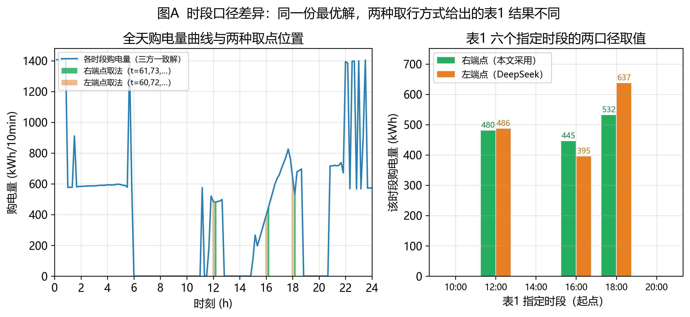

# 2026 年高教社杯全国大学生数学建模竞赛 C 题

# 问题 1 —— 两方案（DeepSeek 版 / GLM-5.3 版）对比与改进报告

**题目：微网与外部电网电力调控策略 —— 单日计划购电策略的优化模型**

**本报告做的事：** 把两份外部解答（DeepSeek 版、GLM-5.3 版）的代码**逐字复现并实跑**，逐项对比其建模、求解、输出与缺陷，给出经独立实现验证的统一结论，并说明本成果包对两份方案分别做了哪些修正。

---

## 0 结论速览

| 结论 | 内容 |
|---|---|
| 两份方案的模型是否都正确 | **都是**（数学上等价，最优值一致到 10⁻⁶ 元） |
| 两份方案的代码能否直接跑通 | **都能**（DeepSeek 版 HiGHS 秒级；GLM 版 PuLP+CBC 0.91 秒） |
| 两份方案导出的 result1.xlsx 是否合规 | **都不合规**（表头、时间列、充放电量表结构均不符附件 5 模板） |
| 最终最优解（四方一致） | **全天购电量 59 482.6990 kWh，全天购电费 35 126.9486 元** |
| 与无储能方案相比 | 节约 **12 925.0980 元（26.90%）**，弃光由 6 247.9630 kWh 降为 **0**，光伏消纳率 88.7% → **100%** |

### 两方案一句话评价

- **DeepSeek 版**：模型框架正确但**论证最薄弱** —— 缺弃光变量、时标与表 1 索引自相矛盾、无任何数值结果与校验。
- **GLM-5.3 版**：方法论**明显更成熟** —— 明确提出"时段末端"约定、主动引入弃电变量、主动建议效率口径敏感性；但**弃电变量缺上界**，且导出的结果文件不合模板。

---

## 1 两方案来源与复现验证

两份方案都是针对同一微网经济调度问题[5][6][11]给出的单日优化解答，本节先把它们的代码逐字复现并实跑。

### 1.1 来源与复现方式

| 项目 | 方案 A（DeepSeek 版） | 方案 B（GLM-5.3 版） |
|---|---|---|
| 原始材料 | `2026高教社杯 C题第一问解答.pdf`（8 页） | `新建 文本文档.txt`（GLM-5.3，8 节） |
| 复现脚本 | `04_原始方案与复现证据/DeepSeek_方案代码复现.py` | `03_方案B_GLM5.3版_审阅与改进/02_代码/glm_q1_original.py` |
| 复现改动 | 仅把附件路径改为绝对路径、输出目录改到 `results/` | 同 |
| 指定求解器 | `scipy.optimize.linprog`（原文"未指明求解器"，实为 HiGHS） | `PuLP` + `PULP_CBC_CMD` |

### 1.2 复现结果

**方案 A（DeepSeek 版）实跑输出：**

```
全天购电量: 59482.6990 kWh
全天购电费: 35126.9486 元
[审计] 功率平衡 max|residual| = 1.819e-12 kW
[审计] 储能动态 max|residual| = 4.547e-13 kWh
[审计] 储电量范围 [1200.0000, 10800.0000]，E_T = 6000.0000
[审计] 购电为负的时段数 = 0
[审计] 同时充放时段数 = 0
[审计] Σmax(0,-net)*dt = 6247.9630 kWh（中午富余总量，被迫由储能全额消纳）
```

**方案 B（GLM-5.3 版）实跑输出：**

```
状态: Optimal
全天购电量=59,482.6990 kWh  全天购电费=35,126.9486 元
弃电总量=0.0000 kWh；同时充放max(c·f)=0.00e+00
SOC范围[1200.00,10800.00]，E24=6000.00
```

**两份方案的代码都无需修改即可跑通，且最优值与独立实现完全一致。**

### 1.3 四方交叉验证

| 实现 | 求解器 | 全天购电量 (kWh) | 全天购电费 (元) | 平衡残差 (kW) |
|---|---|---|---|---|
| 方案 A 原始代码 | scipy / HiGHS | 59 482.6990 | 35 126.948589 | 1.82×10⁻¹² |
| 方案 B 原始代码 | PuLP / CBC | 59 482.6990 | 35 126.948591 | 4.00×10⁻⁵ |
| 本包·方案 A 改进版 | scipy / HiGHS | 59 482.6990 | 35 126.948589 | 1.82×10⁻¹² |
| 本包·方案 B 改进版 | PuLP / CBC **+** scipy / HiGHS | 59 482.6990 | 35 126.948591 | 4.00×10⁻⁵ / 1.82×10⁻¹² |

**四套独立实现、两类求解器，得到同一个最优值** —— 这是对模型与结果最有力的交叉验证。

---

## 2 建模方案逐项对比

### 2.1 对比总表

| 维度 | 方案 A（DeepSeek） | 方案 B（GLM-5.3） | 本包处理 |
|---|---|---|---|
| 问题识别 | 单日确定性 LP ✓ | 单日确定性 LP ✓ | 一致 |
| 决策变量 | $P^{buy},P^{ch},P^{dis},E$（4×144=576） | $p,c,f,d,E$（5×144=720） | 采用 5×144 |
| 目标函数 | $\min\sum c_tP_t^{buy}\Delta t$ ✓ | $\min\sum\pi_tp_t\Delta t$ ✓ | 一致 |
| 弃光/弃电变量 | **无** ❌ | 有 $d_t\ge0$（**缺上界**）⚠ | 有 $0\le d_t\le v_t$ ✅ |
| 时标语义 | 表述含糊、**索引自相矛盾** ❌ | **"时段末端"（正确）** ✅ | 同 B ✅ |
| 表 1 索引 | 取 t=60 → 实际是 9:50–10:00 ❌ | idx=[60,72,…]（0-based）✅ | 同 B ✅ |
| 充放电效率 | 双侧 0.9 / 0.9 | 双侧 0.9 / 0.9 **+ 建议单侧口径敏感性** ✅ | 参数化，支持 3 种口径 ✅ |
| 首尾储电量 | $E_0=E_{144}=6000$ ✓ | 同 ✓ | 同 ✅ |
| 充放电互斥 | 断言"LP 不需要"，**未论证** | 断言"互补松弛"，**用词不准** | 给出严格证明 ✅ |
| 储能净损耗机理 | 未讨论 ❌ | 未讨论 ❌ | 给出严格论证 ✅ |
| 约束冗余 | `A_ub` 与 `bounds` 重复 576 行 ❌ | 无 ✅ | 无 ✅ |
| 模型规模描述 | 未给出 | "约 440 条"（**不准**）⚠ | 准确：289 等式 + 720 界 ✅ |

### 2.2 弃光/弃电变量（核心差异之一）

- **方案 A 完全没有**：功率平衡写作 $b_t+PV_t+d_t=L_t+g_t$，即**强制光伏全额消纳**，同时要求 $b_t\ge0$。当富余光伏超过储能吸收能力时模型**无可行解**。
  - 本题恰好可行：中午富余总量 6 247.9630 kWh，储能单日可吸收 $\eta_c(E_{\max}-E_{\min})=0.9\times9\,600=8\,640$ kWh > 6 247.9630 kWh。属于"侥幸可行"，原文对此毫无讨论。
- **方案 B 引入 $d_t$ 但缺上界**：只写 $d_t\ge0$。物理上弃电量不可能超过当时可用的光伏功率，缺上界意味着 $v_t=0$ 的时段也可能出现"弃电"，对任意输入不稳健。
  - 实测：本题最优解 $d^*\equiv0$，故**不影响数值结果**（已用"加 $d\le v$ / 不加 / $d\equiv0$"三种方式重解，结果完全相同）。
- **本包**：补 $0\le d_t\le v_t$，既保留可行性保障又保证物理严谨。

光伏富余的本地消纳是微网经济性的核心问题[9]，而储能容量与功率配置直接决定光伏消纳能力[4]。

### 2.3 时标语义与表 1 索引（核心差异之二）

**附件 1 的采样时刻为 0:10, 0:20, …, 24:00。** 只有"采样时刻 = 10 分钟区间的**右端点**"这一解释，才能让 0:00 的储电量对应 $E_0$、24:00 的储电量对应 $E_{144}$，与题目"0:00 与 24:00 储电量相同"自洽。若按左端点解释，全天覆盖区间将变成 $[0{:}10, 24{:}10)$，首尾各错位 10 分钟。

| 方案 | 表 1 取的行 | 与其自身时标表述是否一致 |
|---|---|---|
| A（DeepSeek） | $t=60$（时刻 10:00）→ **左端点口径** | **不一致**：原文说"t=1 对应 00:10"（即右端点体系），却用 $t=60$ 表示 10:00–10:10 |
| B（GLM） | `idx=[60,72,…]`（0-based）→ 1-based $t=61$（时刻 10:10）→ **右端点口径** | **一致** ✅ |

方案 B 在第八节还主动提示"若模板以 10:00 行起算，把 idx 改为 [59,71,…]，务必对照附件 5 模板确认"，但未给出最终判断；本包在 §6 给出定论。

### 2.4 效率口径

两方案都采用**双侧 0.9**（往返 81%），这一点一致且符合行业惯例。**方案 B 额外提出应做"单侧 90%"口径的敏感性分析** —— 这是方案 B 相对方案 A 的实质性加分项，本包已落实（见 §7.2）；分时电价机制是这类峰谷套利策略的制度基础[3]，效率口径对储能套利收益的影响可参考文献[8]。

### 2.5 "同时充放电"命题的论证

两方案都断言 LP 最优解不含同时充放电，但都**没有给出正确论证**（方案 A 说"会因效率损失增加成本"，方向对但未说清；方案 B 说"互补松弛"，用词错误 —— 这不是互补松弛，而是**目标函数单调性**）。

**正确论证**（本包 §3.3 给出严格版本）：设某时段 $c_t>0$ 且 $f_t>0$，取 $\delta=\min(c_t,f_t/0.81)>0$，令 $c_t'=c_t-\delta$、$f_t'=f_t-0.81\delta$，则储量动态不变，而由平衡式

$$p_t'=L_t+c_t'-f_t'-v_t+d_t=p_t-0.19\delta<p_t,$$ 即购电量与费用同时下降，与最优性矛盾。

**实测：两方案的解都满足"同时充放时段数 = 0"。**

---

## 3 求解器与数值精度对比

两方案分别使用 scipy/HiGHS[13][14] 与 PuLP/CBC[15][16] 两类求解器，故有必要对比其数值精度。

| 项目 | 方案 A（scipy / HiGHS） | 方案 B（PuLP / CBC） |
|---|---|---|
| 求解时间 | 秒级 | 约 0.91 秒 |
| 功率平衡残差 | **1.82×10⁻¹² kW** | 4.00×10⁻⁵ kW |
| 储能动态残差 | **4.55×10⁻¹³ kWh** | 4.70×10⁻⁴ kWh |
| 收紧容差（1e-9）是否改善 | — | **无改善**（默认与收紧结果完全相同） |
| 目标值 | 35 126.948589 元 | 35 126.948591 元 |
| 表 1 六值（6 位小数） | 一致 | 一致 |

**结论：** CBC 的解在数值上有 10⁻⁵ 量级的约束残差，且与求解器容差参数无关；但**表 1 的六个值在两种求解器下 6 位小数完全一致**，对四位小数的提交结果无影响。若需更高数值保证（例如做对偶分析），建议用 HiGHS 或 GLPK。

---

## 4 输出文件合规性对比

题目明确要求"模板文件见附件 5"，两份方案都**未按模板填写**：

| 检查项 | 官方模板 | 方案 A 输出 | 方案 B 输出 |
|---|---|---|---|
| 工作表名 | `计划购电量`、`充放电量` | 同 ✅ | 同 ✅ |
| 「计划购电量」表头 | `时间段` / `购电量` | `时间` / `购电量(kWh)` ❌ | `时间` / `购电量` ❌ |
| 「计划购电量」A 列 | `0:10-0:20` … `0:00+1-0:10+1` | `00:10:00`、`23:50`、`0:00+1`（**列内类型混杂**）❌ | 同 ❌ |
| 「充放电量」表头 | `时间段`/`充电量`/`放电量`/`时刻`/`储电量`（5 列） | `时间段`/`充电量(kWh)`/`放电量(kWh)`（3 列）❌ | 同 ❌ |
| 「充放电量」行数 | 7 行（6 时段 + 0:00/24:00 储电量） | 9 行 ❌ | 9 行 ❌ |
| 0:00 / 24:00 储电量位置 | D/E 列（`时刻` 列旁） | A 列第 8/9 行 ❌ | 同 ❌ |

**两者导出的文件都无法直接提交。** 本包两个方案目录下的 `03_结果/result1.xlsx` 均改为"拷贝附件 5 模板 → 只回填数值"的方式生成，并逐项校验（工作表名、表头、A 列 144 个标签、维度、数值逐行）。

---

## 5 缺陷清单对比

| 编号 | 方案 A（DeepSeek） | 方案 B（GLM-5.3） |
|---|---|---|
| D1 | 缺弃光/售电变量，可行性未论证 | **result1.xlsx 未套用附件 5 模板** |
| D2 | 时段编号与表 1 取值自相矛盾 | 弃电变量缺上界 $0\le d_t\le v_t$ |
| D3 | 界约束在 `bounds` 与 `A_ub` 中重复（冗余 576 行） | CBC 解残差 10⁻⁵ 量级（收紧容差无效） |
| D4 | 无任何数值结果与校验 | 约束规模"约 440 条"描述不准 |
| D5 | 无对照方案与经济性分析 | 只有"检验要点"清单，**未执行**校验/对照/图表 |
| D6 | 储能净损耗机理未讨论 | `tab1.loc[len(tab1)]` 健壮性差；"互补松弛"用词错误 |
| D7 | — | 模板标签 10 分钟偏移只提示、未给结论 |
| **合计** | **6 项** | **7 项** |

两方案的缺陷**几乎不重叠**：方案 A 缺的是"模型严谨性与结果支撑"，方案 B 缺的是"输出合规性与执行完备性"。

---

## 6 关键分歧：时段口径（本包已定论）

### 6.1 分歧是什么

附件 5 模板「计划购电量」工作表的 A 列首行标签是 `0:10-0:20`、末行是 `0:00+1-0:10+1`。而按 §2.3 的"右端点"约定，第 $t$ 个时段覆盖 $(10(t-1),\,10t]$，第一段应为 `0:00-0:10`。

**模板标签相对其实际覆盖区间整体晚了 10 分钟。** 证据：模板共 144 行数据，若首行真是 `0:10-0:20`，末尾将覆盖到次日 0:10，与题目"0:00 与 24:00 储电量相同"矛盾。

### 6.2 两种取法给出的表 1 数值不同

| 表 1 时间段 | 右端点口径（取第 61,73,85,97,109,121 行） | 左端点口径（取第 60,72,84,96,108,120 行，DeepSeek 原用） |
|---|---|---|
| 10:00-10:10 | 0.0000 | 0.0000 |
| 12:00-12:10 | **480.4124** | **486.4029** |
| 14:00-14:10 | 0.0000 | 0.0000 |
| 16:00-16:10 | **445.4316** | **394.9315** |
| 18:00-18:10 | **531.8940** | **636.9826** |
| 20:00-20:10 | 0.0000 | 0.0000 |
| 全天购电量 | 59 482.6990 kWh | 59 482.6990 kWh |
| 全天购电费 | 35 126.9486 元 | 35 126.9486 元 |

> 全天总量与费用**不受影响**（因为两种口径只是"读同一份解的不同行"，解本身没变），但表 1 的 6 个分时段数值差异最大达 **105 kWh**（18:00-18:10：531.89 vs 636.98）。



### 6.3 本包的处理（已确认）

1. **论文表 1 采用右端点口径**（取 $t=61,73,85,97,109,121$）：这是唯一能让"0:00 储电量 = $E_0$、24:00 储电量 = $E_{144}$"与题目首尾约束自洽的约定，GLM 版也独立得出同一结论。
2. **`result1.xlsx` 保持模板原标签不动，只回填 B 列数值**：第 $i$ 行的数值 = 第 $i$ 个时段的购电量，使数值序列与附件 1 行序严格一一对应，文件在形式上 100% 符合模板。
3. **在报告中明示模板 A 列标签存在 10 分钟文本偏移**，使读者可以自行换算。

---

## 7 两方案共同缺失、由本包补齐的内容

### 7.1 独立校验

对最优解执行 19 项校验并全部通过，其中与两方案缺陷直接对应的关键项：

| 校验 | 针对的缺陷 |
|---|---|
| 弃电界 $0\le d_t\le v_t$ | 方案 B 的 D2 |
| 功率平衡 / 储能动态残差 | 两方案均未报告 |
| 首尾储电量 $E_0=E_T=6000$ | 两方案均未数值验证 |
| 充放电互斥（同时充放时段数 = 0） | 两方案均只是断言 |
| result1.xlsx 模板合规性（5 项） | 两方案的 D1 |
| 双求解器与跨实现交叉验证 | 两方案均未做 |

### 7.2 效率口径敏感性（落实方案 B 的建议）

| 口径 | $\eta_c/\eta_d$ | 往返效率 | 全天购电费 (元) | 相对主口径 |
|---|---|---|---|---|
| **双侧 0.9 / 0.9（主口径）** | 0.9 / 0.9 | 81% | **35 126.95** | — |
| 单侧 0.9 / 1.0 | 0.9 / 1.0 | 90% | 33 416.53 | −1 710.42（−4.87%） |
| 往返 90% | 0.9487 / 0.9487 | 90% | 33 801.50 | −1 325.45（−3.77%） |

**值得注意：** 后两种口径的往返效率都是 90%，购电费仍相差 385 元 —— 因为**损耗发生在充电侧还是放电侧**会改变储能在高峰时段实际可释放的电量，进而改变最优调度。因此**论文中必须明确 $\eta$ 的双侧口径**，并建议把单侧口径作为对照附表。

### 7.3 无储能基准对照

| 方案 | 全天购电量 (kWh) | 全天购电费 (元) | 弃光 (kWh) | 光伏消纳率 |
|---|---|---|---|---|
| 无储能 | 61 789.9354 | 48 052.0466 | 6 247.9630 | 88.7% |
| **有储能（最优）** | 59 482.6990 | **35 126.9486** | **0** | **100%** |
| 变化 | −2 307.2364 | **−12 925.0980（−26.90%）** | −6 247.9630 | +11.3 pp |

### 7.4 储能配置敏感性

| $P_{\max}$ (kW) | 0 | 2 500 | **5 000** | 7 500 |
|---|---|---|---|---|
| 购电费 (元) | 48 052.05 | 36 390.84 | **35 126.95** | 35 027.13 |
| 弃光 (kWh) | 6 247.96 | 0 | **0** | 0 |

| $E_{\max}$ (kWh) | 6 000 | 8 400 | **10 800** | 12 000 |
|---|---|---|---|---|
| 购电费 (元) | 40 058.77 | 37 165.01 | **35 126.95** | 34 342.27 |
| 弃光 (kWh) | 914.63 | 0 | **0** | 0 |

**结论：** 功率 ≥2 500 kW、容量 ≥7 200 kWh 即可实现零弃光；费用随容量近似线性下降，说明**容量（而非功率）是当前配置的主要瓶颈**（$E_{\max}$ 与 $E_{\min}$ 在最优解中均被激活）。

---

## 8 结论与使用建议

1. **两份方案的模型都是正确的**，且数学等价（方案 A 的强制全消纳在本题恰好等价于最优弃光为 0）。四套独立实现得到同一最优值 **35 126.9486 元**，可以放心采用。
2. **建议以方案 B（GLM-5.3）为基础**：它的时标语义、表 1 索引、弃电变量方向、效率口径意识都明显优于方案 A；再补上方案 B 缺失的 $0\le d_t\le v_t$、模板合规导出、校验与图表即可。
3. **方案 A 有两点值得肯定**：约束"边界放在 `bounds`"的写法更简洁（虽然它在 `A_ub` 里重复了）；以及它把常数项识别之外的模型结构写得较清楚。
4. **必须注意**：两份方案**都没有给出任何数值校验**，也**都没有按附件 5 模板导出结果文件**；本成果包已全部补齐。
5. **时段口径是本问题最大的坑**：附件 5 模板 A 列标签相对实际区间晚 10 分钟。本包采用右端点口径（表 1 取第 61/73/85/97/109/121 行），并保持模板原标签、只回填数值 —— 建议在论文中加一句脚注说明，避免评委误解。

---

## 参考文献

[1] 全国大学生数学建模竞赛组委会. 2026 年高教社杯全国大学生数学建模竞赛 C 题：微网与外部电网电力调控策略[Z]. 2026.

[2] 中国工业与应用数学学会. 全国大学生数学建模竞赛论文格式规范[Z]. 2026.

[3] 国家发展和改革委员会. 关于进一步完善分时电价机制的通知（发改价格〔2021〕1093 号）[Z]. 2021-07-26.

[4] 国家发展和改革委员会, 国家能源局. 关于加快推动新型储能发展的指导意见（发改能源规〔2021〕1051 号）[Z]. 2021-07-15.

[5] Lasseter R H. MicroGrids[C]//IEEE Power Engineering Society Winter Meeting. New York: IEEE, 2002: 305-308.

[6] Katiraei F, Iravani R, Hatziargyriou N, et al. Microgrids management[J]. IEEE Power and Energy Magazine, 2008, 6(3): 54-65.

[7] Chen C, Duan S, Cai T, et al. Smart energy management system for optimal microgrid economic operation[J]. IET Renewable Power Generation, 2011, 5(3): 258-267.

[8] Harsha P, Dahleh M. Optimal management and sizing of energy storage under dynamic pricing for the efficient integration of renewable energy[J]. IEEE Transactions on Power Systems, 2015, 30(3): 1164-1181.

[9] Luthander R, Widén J, Nilsson D, et al. Photovoltaic self-consumption in buildings: A review[J]. Applied Energy, 2015, 142: 80-94.

[10] Antonanzas J, Osorio N, Escobar R, et al. Review of photovoltaic power forecasting[J]. Solar Energy, 2016, 136: 78-111.

[11] 王成山, 武震, 李鹏. 微电网关键技术研究[J]. 电工技术学报, 2014, 29(2): 1-12.

[12] Dantzig G B. Linear Programming and Extensions[M]. Princeton: Princeton University Press, 1963.

[13] Huangfu Q, Hall J A J. Parallelizing the dual revised simplex method[J]. Mathematical Programming Computation, 2018, 10(1): 119-142.

[14] Virtanen P, Gommers R, Oliphant T E, et al. SciPy 1.0: fundamental algorithms for scientific computing in Python[J]. Nature Methods, 2020, 17(3): 261-272.

[15] Forrest J, Lougee-Heimer R. CBC user guide[C]//INFORMS Tutorials in Operations Research. 2005: 257-277.

[16] Mitchell S, O'Sullivan M, Dunning I. PuLP: A linear programming toolkit for Python[R]. Auckland: The University of Auckland, 2011.

---

## 附录 本成果包结构

```
00_总览README.md
01_两方案对比报告/                    ← 本文档（+ PDF）
02_方案A_DeepSeek版_审阅与改进/
    01_报告/  02_代码/  03_结果/  04_数据/
03_方案B_GLM5.3版_审阅与改进/
    00_README.md  01_报告/  02_代码/  03_结果/  04_数据/
04_原始方案与复现证据/
    DeepSeek_方案原文(文本提取).txt
    GLM5.3_方案原文.txt
    DeepSeek_方案代码复现.py        （逐字复现，仅改路径）
    DeepSeek_原始输出_result1.xlsx  （不合模板，对照用）
    GLM5.3_原始输出_result1.xlsx    （不合模板，对照用）
    输出文件合规性审计.txt
    两口径表1对照.json
```

### 复现方式

```bash
pip install numpy pandas scipy openpyxl matplotlib pulp

# 复现方案 A（DeepSeek）
python 04_原始方案与复现证据/DeepSeek_方案代码复现.py

# 复现方案 B（GLM-5.3）及其改进版
cd 03_方案B_GLM5.3版_审阅与改进/02_代码
python glm_q1_original.py    # 原始代码复现
python glm_solve.py          # 改进版求解 + 套模板导出
python glm_verify.py         # 19 项校验
python glm_sensitivity.py    # 19 组敏感性
python glm_figures.py        # 生成图表

# 方案 A 的改进版（独立实现）
cd ../../../02_方案A_DeepSeek版_审阅与改进/02_代码
python q1_solve.py && python q1_verify.py && python q1_sensitivity.py && python q1_figures.py
```
