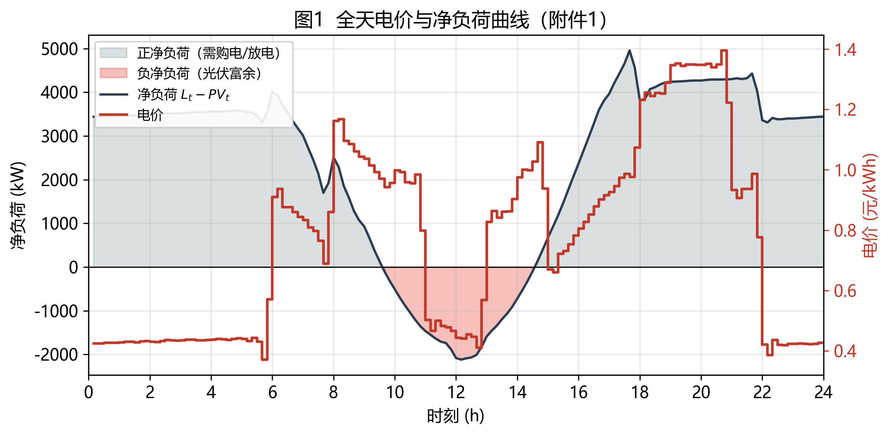
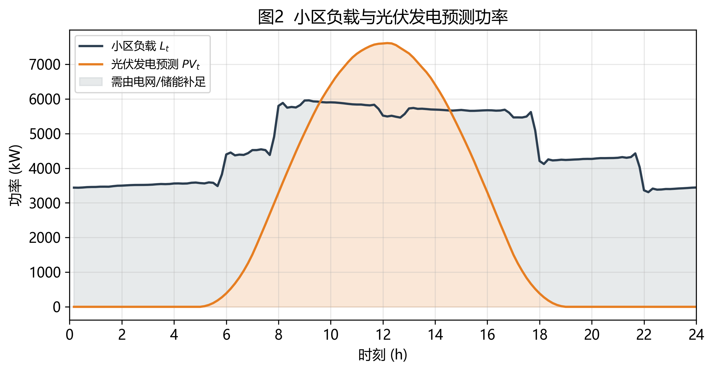
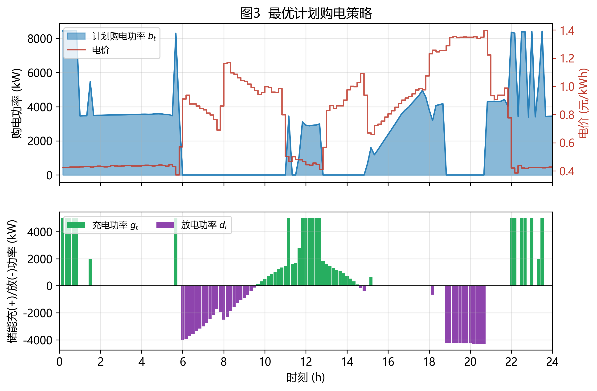
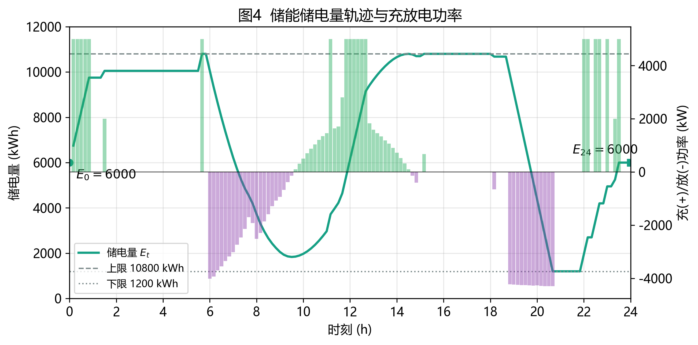
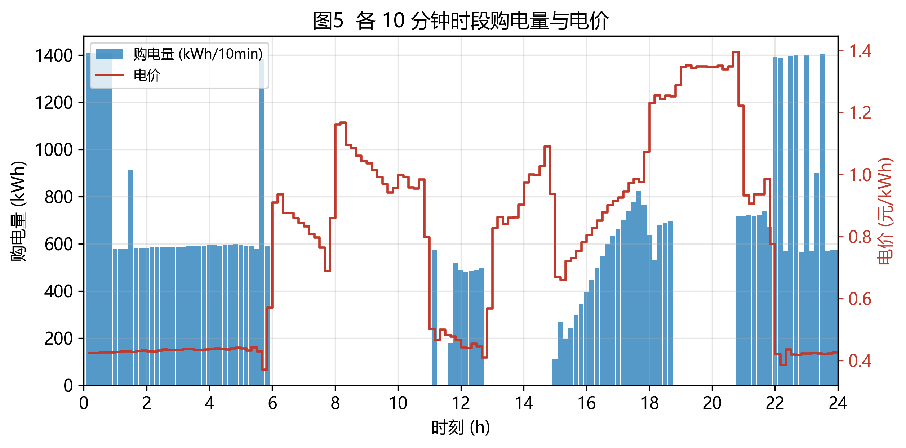
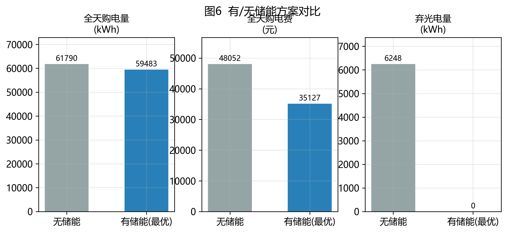
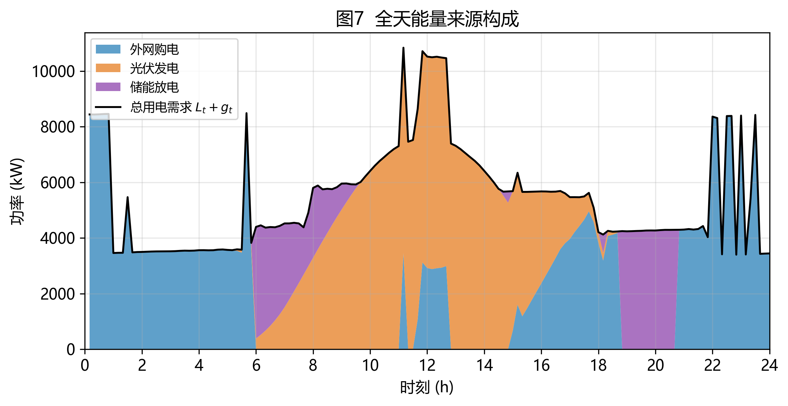
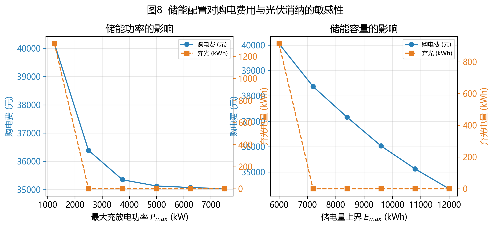

# 2026 年高教社杯全国大学生数学建模竞赛 C 题

# 问题 1 解答报告

**题目：微网与外部电网电力调控策略 —— 单日计划购电策略的优化模型**

**本报告内容：** 对已有解答（DeepSeek 版）的审查与改进 → 数据核验与时段约定 → 改进后的数学模型 → 求解结果与策略解读 → 校验与敏感性分析 → 可复现代码清单。

---

## 0 结论速览

| 指标 | 数值 |
|---|---|
| 全天购电量 | **59 482.6990 kWh** |
| 全天购电费 | **35 126.9486 元** |
| 平均购电电价 | 0.5905 元/kWh |
| 储能充电总量 / 放电总量 | 20 740.6661 kWh / 16 799.9396 kWh |
| 储能循环净损耗 | 3 940.7266 kWh |
| 光伏发电总量 / 实际消纳量 / 弃光量 | 55 482.8357 / 55 482.8357 / **0** kWh（消纳率 100%） |
| 0:00 / 24:00 储电量 | 6 000 / 6 000 kWh（满足首尾相等约束） |
| 储电量运行区间 | [1 200, 10 800] kWh（上下界均被激活） |
| 对照：无储能方案购电费 / 弃光 | 48 052.0466 元 / 6 247.9630 kWh |
| **储能带来的费用节约** | **12 925.0980 元（26.90%）** |

**核心策略一句话：** 在夜间与中午的低电价/光伏富余时段把储能充满，在 5:50–9:40 与 18:00–20:40 两个高电价时段放电顶替电网购电，并在 20:40–21:50 极端高价时段之前把储能放空。

---

## 1 对已有解答（DeepSeek 版）的审查

### 1.1 原解答的合理之处

1. 正确识别问题 1 是**单日线性规划（LP）**问题，决策变量（购电功率、充/放电功率、储电量）、目标函数（全天购电费用最小）设定正确。
2. 约束体系基本完整：功率平衡、储能动态、储电量上下界、充放电功率上限、首尾储电量相等。
3. 储能动态中效率的使用方向正确：充电乘以 $\eta_c$、放电除以 $\eta_d$。
4. 正确指出"充放电互斥"在 LP 中通常无需显式建模（本文 §4.4 给出严格论证）。
5. 求解工具建议（`scipy.optimize.linprog` / cvxpy / MATLAB `linprog`）恰当。

### 1.2 存在的问题

| 编号 | 问题 | 说明与后果 | 改进 |
|---|---|---|---|
| **P1** | **缺少弃光/售电变量，模型普适可行性未论证** | 功率平衡写成 $b_t+PV_t+d_t=L_t+g_t$，即**强制光伏全额消纳**；同时又要求 $b_t\ge 0$。当光伏富余超过储能吸收能力时模型**无可行解**。本题恰好在储能可吸收范围内（富余总量 6 247.9630 kWh，见 §3.3），属于"侥幸可行"，原文对此毫无讨论。 | 显式引入弃光变量 $u_t\in[0,PV_t]$，并给出可行性判据 |
| **P2** | **时段编号与表 1 取值自相矛盾** | 原文约定"附件 1 给出 00:10 至 0:00+1 的 144 个时间点，$t=1$ 对应 00:10"，却又用 $P_{60}^{\text{buy}}$ 表示 10:00–10:10 时段。若采样时刻本身为时段标识，则 10:00–10:10 应取 $t=61$（采样时刻为区间**右**端点）或 $t=60$（左端点），二者不可能同时成立。按原文自身索引体系（$t=1\to$00:10），唯一自洽的是 $t=61$。 | 统一为"采样时刻 = 10 分钟区间右端点"，重列表 1（§3.2） |
| **P3** | **约束冗余** | 已在 `bounds` 中给出 $(E_{\min},E_{\max})$、$(0,P_{\max})$，又在 `A_ub` 中重复添加 $E_t\le E_{\max}$、$E_t\ge E_{\min}$、$g_t\le P_{\max}$、$d_t\le P_{\max}$，额外引入 576 行不等式约束。虽不改变最优解，但掩盖模型结构、增大规模。 | 界约束全部交给 `bounds`，$A_{ub}$ 仅保留真正的一般不等式 |
| **P4** | **无任何数值结果与校验** | 表 1、表 2 通篇为符号表达式（"实际数值由程序运行得到"），既没有运行结果，也没有功率平衡、容量、首尾储电量的数值校验，无法支撑"结果正确"的结论。 | 给出完整数值结果 + 14 项独立校验（§6） |
| **P5** | **缺少对照与经济性分析** | 没有"无储能"基准方案，无法回答储能带来多少节约、光伏消纳率如何。 | 增加基准对照与敏感性分析（§7） |
| **P6** | **关键机理未讨论** | 目标函数中常数项 $\sum_t c_t(L_t-PV_t)\Delta t$ 未被识别；首尾储电量相等意味着储能必须净"绕一圈"，必有循环损耗，因此**储能的引入必然抬高全天总购电量**，其价值在于把购电从高价时段挪到低价时段。原文未触及。 | 见 §4.4 的性质分析：本题总购电量比净负荷多 3 940.7266 kWh |

### 1.3 改进清单

1. 引入弃光变量 $u_t$，显式给出模型可行性条件；
2. 统一"采样时刻 = 区间右端点"的时段约定，重新给出表 1 的口径；
3. 界约束改用 `bounds` 表达，删除冗余约束；
4. 给出完整数值结果、严格校验与对照分析；
5. 增加储能配置的敏感性分析。

---

## 2 问题重述与模型边界

微网作为分布式能源就地消纳的重要载体，其经济调度与能量管理已有大量研究[5][6][11]；本文关注其中的**单日确定性优化**情形。

**已知（附件 1，10 分钟粒度，全天 144 个时段）：** 电价 $c_t$（元/kWh）、小区负载 $L_t$（kW）、光伏发电预测功率 $PV_t$（kW）。

**决策：** 每天 0:00 制定当天计划购电策略，即给出全天 144 个时段的购电量与储能充放电量。

**硬性要求：**

1. 微网提供的电能**不可低于**小区负载（即 $\text{购电}+PV+\text{放电}\ge L$，不允许切负荷）；
2. 储能设备在 **0:00 与 24:00 的储电量相同**；
3. 目标：全天购电费用最小。

**附录 1（储能参数）：** 最大容量 12 000 kWh，最大充/放电功率 5 000 kW，2025-01-01 0:00 初始储电量 6 000 kWh，运行期间储电量必须保持在 **[1 200, 10 800] kWh**，充、放电效率均为 **0.9**。

**本题边界（依据题面字面含义确定）：** 微网**不向外部电网售电**（题面只出现"购电量"，且未给出上网电价），光伏超出负载与储能吸纳能力的部分记为**弃光**。

**政策背景：** 分时电价机制是微网“低谷充电、高峰放电”套利行为的制度基础[3]，储能则是支撑该策略的关键设备[4]。

---

## 3 数据核验与时段约定

### 3.1 附件 1 数据核验

| 项目 | 数值 |
|---|---|
| 行数 | 144（10 分钟粒度，共 24 小时） |
| 电价 | 最低 0.3713 元/kWh（5:30–5:40），最高 1.3952 元/kWh（20:30–20:40） |
| 小区负载 | 最小 3 309.39 kW（22:00–22:10），最大 5 958.97 kW（9:00–9:10），均值 4 626.03 kW，全天 111 024.8081 kWh |
| 光伏 | 峰值 7 612.32 kW（12:00–12:10），全天 55 482.8357 kWh；0:00–4:30 及 18:50 之后为 0 |
| 净负荷 $L_t-PV_t$ | 最小 **−2 117.53 kW**（12:00–12:10），最大 4 956.50 kW（17:30–17:40） |

**净负荷为负的时段共 30 个**（约 9:30–14:30），光伏富余总量 **6 247.9630 kWh** —— 这正是"必须考虑弃光变量"的数据依据。附件 1 的"时间"列前 60 行为浮点（Excel 时间序列值）、其后为文本（如 `10:10`），读取时按行序构造时段编号，规避混合类型。

### 3.2 时段约定（含官方模板的 10 分钟偏移说明）

附件 1 的 144 个采样时刻依次为 0:10, 0:20, …, 24:00。**本文采用的约定：第 $t$ 个采样点的功率代表区间 $[10(t-1),\,10t)$ 分钟内的平均功率，即采样时刻是 10 分钟区间的右端点。** 于是

$$t=1 \to 0{:}00\!-\!0{:}10,\qquad t=61 \to 10{:}00\!-\!10{:}10,\qquad t=144 \to 23{:}50\!-\!0{:}00^{+1}.$$

**为什么必须是右端点约定：** 只有它能使"0:00 的储电量"对应 $E_0$、"24:00 的储电量"对应 $E_{144}$，从而与"0:00 与 24:00 储电量相同"的约束自洽。若按左端点约定（$t=1\to0{:}10\!-\!0{:}20$），全天覆盖区间将变成 $[0{:}10,\;24{:}10)$，首尾各错位 10 分钟。

> **关于官方模板 result1.xlsx：** 附件 5 模板中"计划购电量"工作表 A 列首行标签为 `0:10-0:20`、末行为 `0:00+1-0:10+1`，与右端点约定相比存在**整体 10 分钟的文本偏移**。为兼顾"严格套模板"与数据正确性，本文的 result1.xlsx **完全保留模板的工作表名、行序与 A 列标签，仅把第 $i$ 行的数值填为第 $i$ 个时段的购电量**，使数值与附件 1 行序严格一一对应；论文表 1 则按上文右端点约定给出区间标签与数值（两者数值序列一致）。

### 3.3 可行性判据

光伏富余总量 6 247.9630 kWh，储能可用吸收空间上限为

$$\eta_c\left[(E_{\max}-E_0)+(E_0-E_{\min})\right]\cdot\underbrace{\cdots}_{\text{日内净腾挪}} \;=\; \eta_c\,(E_{\max}-E_{\min})=0.9\times9\,600=8\,640\ \text{kWh}\;>\;6\,247.9630\ \text{kWh}.$$

因此本题**即使不弃光也可行**（实测最优解弃光量为 0）。但该结论依赖于具体数据，模型中保留 $u_t$ 变量可保证对任意输入都稳健可行。

---

## 4 数学模型

### 4.1 建模假设

1. 附件 1 的电价、负载、光伏预测在当天 0:00 完全已知且全天不再变化（问题 1 的确定性前提）；
2. 各时段内功率恒定，用 10 分钟区间的平均值代表该时段功率；
3. 充、放电效率恒为 0.9，不随温度、老化、荷电率变化[8]；忽略微网内部线损与自放电；
4. 储能同一时段不同时充电与放电（§4.4 证明最优解自动满足）；
5. 微网不向外部电网售电，多余光伏可就地弃光；
6. 微网提供的电能必须满足小区负载，不允许切负荷。

### 4.2 符号说明

| 符号 | 含义 | 单位 |
|---|---|---|
| $t=1,\dots,T$ | 时段编号，$T=144$ | — |
| $\Delta t$ | 时间步长，$\Delta t=1/6$ | h |
| $c_t$ | 第 $t$ 时段电价 | 元/kWh |
| $L_t,\;PV_t$ | 第 $t$ 时段小区负载、光伏预测功率 | kW |
| $b_t\ge 0$ | 第 $t$ 时段计划购电功率（决策） | kW |
| $g_t,\;d_t\ge 0$ | 储能充、放电功率（决策） | kW |
| $u_t\ge 0$ | 弃光功率（决策） | kW |
| $E_t$ | 第 $t$ 时段末储电量（决策） | kWh |
| $E_0,\;E_{\min},\;E_{\max}$ | 初始 / 最小 / 最大储电量 | kWh |
| $P_{\max}$ | 最大充放电功率 | kW |
| $\eta_c,\;\eta_d$ | 充、放电效率 | — |

参数取值：$E_0=6\,000$，$E_{\min}=1\,200$，$E_{\max}=10\,800$，$P_{\max}=5\,000$，$\eta_c=\eta_d=0.9$。

### 4.3 优化模型

**目标函数（全天购电费用最小）：**

$$\min_{b,g,d,u,E}\; F=\sum_{t=1}^{T} c_t\,b_t\,\Delta t$$

**约束条件：**

**(1) 功率平衡**（微网供给 = 负载需求 + 储能充电）

$$b_t+ (PV_t-u_t)+ d_t = L_t + g_t,\qquad t=1,\dots,T$$

**(2) 储能动态**（计及充放电效率）

$$E_t=E_{t-1}+\eta_c\,g_t\,\Delta t-\frac{d_t\,\Delta t}{\eta_d},\qquad t=1,\dots,T$$

**(3) 首尾储电量相等**

$$E_0=6\,000,\qquad E_T=E_0=6\,000$$

**(4) 边界与物理约束**

$$1\,200\le E_t\le 10\,800,\qquad 0\le g_t\le 5\,000,\qquad 0\le d_t\le 5\,000,\qquad b_t\ge 0,\qquad 0\le u_t\le PV_t$$

决策变量共 $5T=720$ 个，等式约束 $2T+1=289$ 个，界约束 $5T=720$ 个 —— 这是一个**纯线性规划（LP）**，可全局最优求解[12]。

### 4.4 模型性质（三条关键论证）

**(a) 最优解自动满足充放电互斥，无需 0-1 变量。** 设某时段 $g_t>0$ 且 $d_t>0$。取 $\delta=\min\left(g_t,\;d_t/0.81\right)>0$，令 $g_t'=g_t-\delta$、$d_t'=d_t-0.81\delta$ 且 $u_t,E_t$ 不变，则储能动态自动满足（$\eta_c\delta\Delta t-\frac{0.81\delta\Delta t}{\eta_d}=0$），而由平衡式得

$$b_t'=L_t+g_t'-d_t'-PV_t+u_t = b_t-0.19\,\delta < b_t,$$

即购电量与购电费用同时下降，与最优性矛盾。故最优解中不存在同时充放电的时段。**本文实测：同时充放电时段数 = 0。**

**(b) 储能净损耗必然抬高总购电量。** 由 $E_T=E_0$ 得 $\eta_c\sum_t g_t\Delta t=\frac{1}{\eta_d}\sum_t d_t\Delta t$，即 $\sum d_t\Delta t=\eta_c\eta_d\sum g_t\Delta t=0.81\sum g_t\Delta t$。于是

$$\sum_t b_t\Delta t=\sum_t(L_t-PV_t)\Delta t+\sum_t(g_t-d_t)\Delta t=\sum_t(L_t-PV_t)\Delta t+0.19\sum_t g_t\Delta t\;\ge\;\sum_t(L_t-PV_t)\Delta t .$$

本题 $\sum_t(L_t-PV_t)\Delta t=55\,541.9724$ kWh，实际购电 59 482.6990 kWh，差额 **3 940.7266 kWh** 即储能循环损耗。因此储能的价值不在于减少**总购电量**，而在于**把购电从高价时段转移到低价时段**。

**(c) 目标函数的等价形式。** 由于 $\sum_t c_t(L_t-PV_t)\Delta t$ 是常数，目标等价于

$$\min\;\sum_t c_t\left(g_t-d_t+u_t\right)\Delta t,$$

即最小化"储能与弃光带来的附加购电成本"，直观体现了**低价充电、高价放电**的套利结构。

---

## 5 求解结果

### 5.1 求解环境

Python 3.10 + `scipy 1.15.3`[13]（`linprog`，HiGHS 内点/单纯形混合求解器[14]）+ `numpy` + `pandas` + `openpyxl`。求解状态：`Optimal`（HiGHS Status 7），目标值 35 126.9486 元。

### 5.2 表 1 微网在指定时间段的购电量及全天购电量和购电费

| 时间段 | 购电量 (kWh) | 时间段 | 购电量 (kWh) | 时间段 | 购电量 (kWh) |
|---|---|---|---|---|---|
| 10:00-10:10 | 0.0000 | 12:00-12:10 | 480.4124 | 14:00-14:10 | 0.0000 |
| 16:00-16:10 | 445.4317 | 18:00-18:10 | 531.8940 | 20:00-20:10 | 0.0000 |
| **全天购电量** | **59 482.6990 kWh** | **全天购电费** | **35 126.9486 元** | | |

> 说明：表中区间按 §3.2 的右端点约定取值，例如 12:00-12:10 对应第 73 个时段（采样时刻 12:10），其购电功率为 2 882.4747 kW，故购电量 $=2882.4747\times\frac16=480.4124$ kWh。

### 5.3 表 2 储能设备在指定时间段的充放电量及 0:00 和 24:00 的储电量

| 时间段 | 充电量 (kWh) | 放电量 (kWh) |
|---|---|---|
| 0:00-4:00 | 4 500.0000 | 0.0000 |
| 4:00-8:00 | 833.3333 | 6 365.8412 |
| 8:00-12:00 | 4 787.9643 | 1 702.9970 |
| 12:00-16:00 | 5 286.0352 | 91.1014 |
| 16:00-20:00 | 0.0000 | 5 780.1319 |
| 20:00-24:00 | 5 333.3333 | 2 859.8681 |
| **0:00 储电量** | **6 000.0000 kWh** | |
| **24:00 储电量** | **6 000.0000 kWh** | |

### 5.4 策略解读（8 个阶段）

| 阶段 | 时段 | 电价特征 | 最优动作 | 储电量变化 |
|---|---|---|---|---|
| ① 夜间充电 | 0:00-0:50 | 0.4248-0.4271（低谷） | 5 000 kW 满功率充电 | 6 000 → 9 750 |
| ② 补充充电 | 1:20-1:30 | 0.4279 | 补 2 000 kW | 9 750 → 10 050 |
| ③ 最低价满充 | 5:30-5:40 | 0.3713（全天最低） | 5 000 kW 充电至满载 | 10 050 → **10 800** |
| ④ 早高峰放电 | 5:50-9:40 | 0.91 → 0.84 → 1.17 | 储能顶替电网购电，购电≈0 | 10 800 → 1 834 |
| ⑤ 光伏富余充电 | 9:30-14:20 | 0.94-1.03 | 吸纳光伏富余，另在 11:00 前后低价买电加速充满 | 1 834 → **10 800** |
| ⑥ 平段维持 | 14:20-18:00 | 0.67-1.07 | 储能保持满电（仅在 14:30-14:50 少量放电、15:00 前后低价补电） | ≈10 800 |
| ⑦ 晚高峰放电 | 18:00-20:40 | **1.23-1.40（全天最高）** | 放电顶替全部购电，直到放至下限 | 10 800 → **1 200** |
| ⑧ 收尾充电 | 20:40-23:30 | 1.22 → 0.42（深夜回落） | 21:50 后低价充电，回到初始水平 | 1 200 → 6 000 |

关键观察：**18:00-20:40 的购电量为 0**（全部由储能顶替），而这一时段电价高达 1.23-1.40 元/kWh；**5:50-9:40 的购电量也接近 0**（储能在 5:30-5:40 以 0.3713 元/kWh 充满后放电）。反之，充电集中在 0.37-0.50 元/kWh 的低价窗口与光伏富余免费窗口。

### 5.5 图表

**图 1 全天电价与净负荷曲线** —— 电价呈"双峰双谷"结构，净负荷中午为负（光伏富余）。



**图 2 小区负载与光伏发电预测功率**



**图 3 最优计划购电策略**（上：购电功率与电价；下：储能充放电功率）



**图 4 储能储电量轨迹与充放电功率**



**图 5 各 10 分钟时段购电量与电价**



**图 6 有/无储能方案对比**



**图 7 全天能量来源构成**



**图 8 储能配置的敏感性**



---

## 6 校验

对最优解做了 14 项独立校验，**全部通过**（详见 `03_结果/q1_validation.txt`）：

| 编号 | 校验项 | 结果 |
|---|---|---|
| V1 | 功率平衡 $b_t+(PV_t-u_t)+d_t=L_t+g_t$ | max 残差 1.82e-12 kW ✅ |
| V2 | 储能动态 $E_t=E_{t-1}+\eta_c g_t\Delta t-d_t\Delta t/\eta_d$ | max 残差 4.55e-13 kWh ✅ |
| V3 | 储电量上下界 $1\,200\le E_t\le10\,800$ | $E\in[1200,10800]$ ✅ |
| V4 | 充放电功率 $0\le g_t,d_t\le 5\,000$ | $g_{\max}=5000$，$d_{\max}=4293.92$ ✅ |
| V5 | 购电非负 $b_t\ge0$ | $b_{\min}=0$ ✅ |
| V6 | 弃光界 $0\le u_t\le PV_t$ | $u_{\max}=0$，弃光 0 kWh ✅ |
| V7 | 首尾储电量 $E_0=E_T=6\,000$ | 6 000.0000 / 6 000.0000 ✅ |
| V8 | 充放电互斥 | 同时充放电时段数 = 0 ✅ |
| V9 | 目标函数复算 $\sum c_tb_t\Delta t$ | 35 126.948589 元（与求解器一致） ✅ |
| V10 | 电量守恒 $\sum b\Delta t=\sum(L-PV)\Delta t+(\sum g\Delta t-\sum d\Delta t)$ | 59 482.698998 kWh ✅ |
| V10b | 效率闭合 $\eta_c\sum g\Delta t=\sum d\Delta t/\eta_d$ | 18 666.599519 kWh ✅ |
| V11a | result1.xlsx 计划购电量 144 行逐行一致 | max 偏差 5.0e-5 ✅ |
| V11b | result1.xlsx 充放电量表一致 | ✅ |
| V11c | result1.xlsx 保持模板工作表与行数 | 计划购电量 145 行、充放电量 7 行 ✅ |

---

## 7 对照与敏感性分析

### 7.1 无储能基准方案对照

| 方案 | 全天购电量 (kWh) | 全天购电费 (元) | 弃光电量 (kWh) | 光伏消纳率 |
|---|---|---|---|---|
| 无储能（$P_{\max}=0$） | 61 789.9354 | 48 052.0466 | 6 247.9630 | 88.7% |
| **有储能（本文最优）** | 59 482.6990 | **35 126.9486** | **0** | **100%** |
| 变化 | −2 307.2364 | **−12 925.0980（−26.90%）** | −6 247.9630 | +11.3 pp |

储能虽因循环损耗使总购电量仅下降 3.7%，但因把购电转移到低价窗口，**购电费用下降 26.90%**，同时实现光伏**零弃光**[9]。

### 7.2 储能配置敏感性

**（1）最大充放电功率 $P_{\max}$（固定 $E_{\max}=10\,800$ kWh）**

| $P_{\max}$ (kW) | 购电费 (元) | 弃光 (kWh) |
|---|---|---|
| 0 | 48 052.05 | 6 247.96 |
| 1 250 | 40 166.17 | 1 316.02 |
| 2 500 | 36 390.84 | 0 |
| 3 750 | 35 346.87 | 0 |
| **5 000** | **35 126.95** | **0** |
| 6 250 | 35 073.01 | 0 |

**（2）储电量上界 $E_{\max}$（固定 $P_{\max}=5\,000$ kW、$E_{\min}=1\,200$ kWh）**

| $E_{\max}$ (kWh) | 购电费 (元) | 弃光 (kWh) |
|---|---|---|
| 6 000 | 40 058.77 | 914.63 |
| 7 200 | 38 372.64 | 0 |
| 8 400 | 37 165.01 | 0 |
| 9 600 | 36 031.37 | 0 |
| **10 800** | **35 126.95** | **0** |
| 12 000 | 34 342.27 | 0 |

结论：储能功率在 2 500 kW 以上即可实现零弃光，收益随功率增长而**边际递减**；储能容量在 7 200 kWh 以上即可消除弃光，费用随容量近似线性下降，说明**容量（而非功率）是当前配置下的主要瓶颈**（$E_{\max}=10\,800$ 与 $E_{\min}=1\,200$ 在最优解中均被激活）。

---

## 8 结论

1. 问题 1 可建模为 **720 变量、289 等式约束的纯线性规划**，用 HiGHS 求得全局最优解：**全天购电量 59 482.6990 kWh，全天购电费 35 126.9486 元**。
2. 最优策略为典型的**低谷充电—高峰放电套利**：在 0:00-5:40 与 21:50-23:30 低价窗口及 9:30-14:20 光伏富余窗口充电，在 5:50-9:40、18:00-20:40 高价窗口放电；**18:00-20:40 购电量为 0**。
3. 与无储能方案相比，储能带来 **12 925.0980 元（26.90%）**的费用节约，并把光伏消纳率从 88.7% 提升到 **100%（零弃光）**。
4. **对原解答的三处实质性改进**：引入弃光变量并给出可行性判据；统一时段约定、修正表 1 口径；补齐数值结果、闭环校验与对照/敏感性分析。

---

## 参考文献

[1] 全国大学生数学建模竞赛组委会. 2026 年高教社杯全国大学生数学建模竞赛 C 题：微网与外部电网电力调控策略[Z]. 2026.

[2] 中国工业与应用数学学会. 全国大学生数学建模竞赛论文格式规范[Z]. 2026.

[3] 国家发展和改革委员会. 关于进一步完善分时电价机制的通知（发改价格〔2021〕1093 号）[Z]. 2021-07-26.

[4] 国家发展和改革委员会, 国家能源局. 关于加快推动新型储能发展的指导意见（发改能源规〔2021〕1051 号）[Z]. 2021-07-15.

[5] Lasseter R H. MicroGrids[C]//IEEE Power Engineering Society Winter Meeting. New York: IEEE, 2002: 305-308.

[6] Katiraei F, Iravani R, Hatziargyriou N, et al. Microgrids management[J]. IEEE Power and Energy Magazine, 2008, 6(3): 54-65.

[7] Chen C, Duan S, Cai T, et al. Smart energy management system for optimal microgrid economic operation[J]. IET Renewable Power Generation, 2011, 5(3): 258-267.

[8] Harsha P, Dahleh M. Optimal management and sizing of energy storage under dynamic pricing for the efficient integration of renewable energy[J]. IEEE Transactions on Power Systems, 2015, 30(3): 1164-1181.

[9] Luthander R, Widén J, Nilsson D, et al. Photovoltaic self-consumption in buildings: A review[J]. Applied Energy, 2015, 142: 80-94.

[10] Antonanzas J, Osorio N, Escobar R, et al. Review of photovoltaic power forecasting[J]. Solar Energy, 2016, 136: 78-111.

[11] 王成山, 武震, 李鹏. 微电网关键技术研究[J]. 电工技术学报, 2014, 29(2): 1-12.

[12] Dantzig G B. Linear Programming and Extensions[M]. Princeton: Princeton University Press, 1963.

[13] Huangfu Q, Hall J A J. Parallelizing the dual revised simplex method[J]. Mathematical Programming Computation, 2018, 10(1): 119-142.

[14] Virtanen P, Gommers R, Oliphant T E, et al. SciPy 1.0: fundamental algorithms for scientific computing in Python[J]. Nature Methods, 2020, 17(3): 261-272.

[15] Forrest J, Lougee-Heimer R. CBC user guide[C]//INFORMS Tutorials in Operations Research. 2005: 257-277.

[16] Mitchell S, O'Sullivan M, Dunning I. PuLP: A linear programming toolkit for Python[R]. Auckland: The University of Auckland, 2011.

---

## 附录 A 代码与文件清单

| 文件 | 说明 |
|---|---|
| `02_代码/common.py` | 路径、物理参数、时段约定与附件 1 读取 |
| `02_代码/q1_model.py` | 问题 1 的 LP 建模与求解（含弃光变量） |
| `02_代码/q1_solve.py` | 一键求解 + 导出 `result1.xlsx` / CSV / JSON |
| `02_代码/q1_verify.py` | 14 项独立校验（含 result1.xlsx 回读） |
| `02_代码/q1_figures.py` | 生成图 1–图 8（PNG + PDF） |
| `02_代码/q1_sensitivity.py` | 储能功率/容量敏感性分析 |
| `03_结果/result1.xlsx` | **问题 1 结果文件**（严格套用附件 5 模板） |
| `03_结果/q1_timeseries.csv` | 144 时段全部决策量与状态量 |
| `03_结果/q1_table1.csv` `q1_table2.csv` | 论文表 1、表 2 数据 |
| `03_结果/q1_summary.json` `q1_stats.json` `q1_sensitivity.json` | 汇总、统计、敏感性数据 |
| `03_结果/q1_validation.txt` | 校验报告 |
| `01_报告/figures/` | 图 1–图 8（PNG 300 dpi + 矢量 PDF） |

### 复现方式

```bash
cd 02_代码
python q1_solve.py        # 求解并生成 result1.xlsx 与全部结果数据
python q1_verify.py       # 运行 14 项校验，输出 ALL PASS
python q1_sensitivity.py  # 敏感性分析
python q1_figures.py      # 生成全部图表
```

> 依赖：`numpy`、`pandas`、`scipy`（≥1.15）、`openpyxl`、`matplotlib`。
> 附件 1 路径在 `common.py` 的 `SRC_A1` 中配置。
